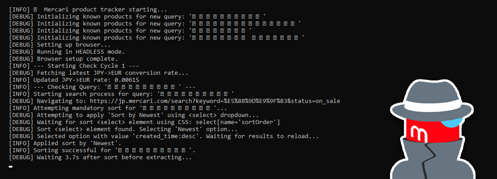

> **This project is archived and no longer maintained.** It may be outdated or incompatible with current dependencies.

---

# 🇯🇵 MercariSpy 🕵️
## Mercari Product Monitor Bot

[](https://www.python.org/)

A Python-based monitoring tool to track new listings on Mercari.jp based on your search queries and receive instant Telegram notifications.

This script uses Selenium and Undetected Chromedriver to simulate real browser activity, aiming to bypass basic bot detection measures employed by Mercari.jp.



---

## Features

*   **Monitors Mercari.jp:** Specifically targets the Japanese version of Mercari.
*   **Multiple Queries:** Tracks several search terms defined in `search_queries.txt`.
*   **Real-time Telegram Alerts:** Sends instant notifications for newly detected listings via a Telegram bot.
*   **Currency Conversion:** Automatically converts JPY prices to EUR using the Frankfurter.app API.
*   **Persistent State:** Remembers previously seen items (`mercari_known_products.json`) to only alert for new ones.
*   **Browser Automation:** Uses `undetected-chromedriver` to appear more like a regular user, handling dynamic content loading.
*   **Headless Mode:** Can run Chrome invisibly in the background.
*   **Configurable:** Settings managed via `config.json`.
*   **Robust Scraping:** Targets visible HTML elements, making it less reliant on potentially protected internal data structures.
*   **Optional White Background Filtering:** Can attempt to filter out listings with likely studio/white backgrounds based on image analysis (requires `Pillow`).
*   **Error Handling & Logging:** Includes basic error handling, logging, and saves screenshots on certain errors for debugging.

## Prerequisites

*   **Python:** Version 3.8 or higher recommended.
*   **pip:** Python package installer.
*   **Google Chrome:** A recent version of the Chrome browser must be installed.
*   **Telegram Account:** To create a bot and receive notifications.

## Installation & Setup

1.  **Clone or Download:**
    ```bash
    git clone https://github.com/Microck/MercariSpy # Or download the ZIP
    cd MercariSpy-main
    ```

2.  **Install Dependencies:**
    Install the `requirements.txt` file with the following content:
    ```txt
    selenium
    undetected-chromedriver
    requests
    python-telegram-bot
    beautifulsoup4
    webdriver-manager
    pillow
    ```
    Then install them:
    ```bash
    pip install -r requirements.txt
    ```

3.  **Configure `config.json`:**
    ```json
    {
      "TELEGRAM_TOKEN": "YOUR_TELEGRAM_BOT_TOKEN",
      "TELEGRAM_CHAT_ID": "YOUR_TELEGRAM_CHAT_ID",
      "USER_AGENT": "Mozilla/5.0 (Windows NT 10.0; Win64; x64) AppleWebKit/537.36 (KHTML, like Gecko) Chrome/110.0.0.0 Safari/537.36",
      "HEADLESS": true,
      "CHECK_INTERVAL_MIN": 240,
      "CHECK_INTERVAL_MAX": 360,
      "SEND_DEBUG_MESSAGES": true,
      "CURRENCY_RATE_UPDATE_INTERVAL_SECONDS": 3600,
      "SEND_ITEM_SCREENSHOTS": false,
      "FILTER_WHITE_BACKGROUNDS": true,
      "WHITE_BG_BORDER_THRESHOLD": 0.90,
      "WHITE_BG_COLOR_THRESHOLD": 245
    }
    ```
    *   **`TELEGRAM_TOKEN`**: **(Required & Sensitive)** Your Telegram Bot Token obtained from BotFather. **Keep this secret!**
    *   **`TELEGRAM_CHAT_ID`**: **(Required)** The ID of the Telegram chat where notifications should be sent. Get this using `@userinfobot` or similar methods.
    *   See the **Configuration** section below for details on other options.

4.  **Modify `search_queries.txt`:**
    Add your Mercari search terms, **one query per line**. Example:
    ```bash
    初音ミクのフィギュア  # Hatsune Miku figurine
    アシンメトリーレザージャケット  # Asymmetrical leather jacket
    デスノートの画集  # Death Note artbook
    トルネードマート フレアジーンズ  # Tornado Mart flared jeans
    ```

5.  **(Optional) First Run in Headed Mode:** It's highly recommended to run the script *once* with `"HEADLESS": false` in `config.json`. This allows you to visually confirm that the browser automation works, selectors are correct, and sorting is applied. Afterwards, set it back to `true` for background operation.

## Configuration (`config.json`)

*   **`TELEGRAM_TOKEN`**: Your Telegram Bot API token.
*   **`TELEGRAM_CHAT_ID`**: Your target chat ID for notifications.
*   **`USER_AGENT`**: The User-Agent string the browser will use.
*   **`HEADLESS`**: `true` to run Chrome invisibly, `false` to show the browser window.
*   **`CHECK_INTERVAL_MIN` / `MAX`**: Min/max time (seconds) between check cycles.
*   **`SEND_DEBUG_MESSAGES`**: `true` to send detailed logs/errors to Telegram.
*   **`CURRENCY_RATE_UPDATE_INTERVAL_SECONDS`**: How often (seconds) to refresh JPY->EUR rate.
*   **`SEND_ITEM_SCREENSHOTS`**: `true` to send item screenshots with alerts (increases rate limit risk).
*   **`FILTER_WHITE_BACKGROUNDS`**: `true` to enable the white background image filter, `false` to disable.
*   **`WHITE_BG_BORDER_THRESHOLD`**: (Used if filter enabled) Percentage (0.0 to 1.0) of border pixels that must be near-white to trigger the filter (e.g., 0.95 = 95%).
*   **`WHITE_BG_COLOR_THRESHOLD`**: (Used if filter enabled) RGB value (0-255) threshold. Pixels with R, G, and B values all *above* this are considered "near-white" (e.g., 245 catches very light grays).

## Usage

Ensure you are in the script's directory in your terminal.

```bash
python mercari_spy.py
```

The script will start, perform an initial check for all queries (populating the `known_products` list), and then enter the main loop, checking periodically based on your configured interval.

**Running in the Background:**

*   **Linux/macOS:** Use tools like `screen` or `nohup`:
    ```bash
    # Using screen (recommended)
    screen -S mercari_spy
    python mercari_spy.py
    # Press Ctrl+A then D to detach

    # Using nohup
    nohup python mercari_spy.py > mercari_spy.log 2>&1 &
    ```
*   **Windows:** Use Task Scheduler to run the script, or run it within a `cmd` or PowerShell window (which must remain open).

## How it Works

1.  **Initialization:** Loads config, queries, and previously known products. Sets up the Telegram bot connection.
2.  **Browser Launch:** Starts an instance of Chrome using `undetected-chromedriver` with specified options (headless, user-agent, etc.).
3.  **Search Cycle:**
    *   Iterates through each query in `search_queries.txt`.
    *   Navigates to the Mercari.jp search results page.
    *   **Mandatory Sort:** Selects the "Sort by Newest" option using Selenium's `Select` class on the dropdown element. **This step is crucial.**
    *   **Wait & Scrape:** Waits for the item container (`#item-grid`) to be present and then finds all item cards (`<li>`) within it.
    *   **Extract Data:** For each item card, it attempts to extract the link, ID, title, price (JPY), and image URL by finding specific elements *within* the card using CSS selectors. It includes fallbacks for robustness.
    *   **Currency Conversion:** Converts the extracted JPY price to EUR.
    *   **Image Analysis (Optional): If FILTER_WHITE_BACKGROUNDS is true and an image URL was found, downloads the image and analyzes border pixels. If deemed likely white background, the item is skipped.
    *   **Take Screenshot:** Captures a screenshot of the individual item card.
4.  **Comparison:** Compares the IDs of extracted items against the list of known product IDs for that query stored in `mercari_known_products.json`.
5.  **Alerting:** If new item IDs are found:
    *   Sends a formatted text message alert to Telegram.
    *   Optionally sends the item screenshot if `SEND_ITEM_SCREENSHOTS` is `true`.
    *   Adds the new item details to the `known_products` dictionary.
6.  **State Saving:** Saves the updated `known_products` dictionary to `mercari_known_products.json`.
7.  **Wait:** Pauses for the configured interval before starting the next cycle.

## Important Notes & Warnings

*   **Selector Fragility:** This script relies on scraping visible HTML elements using CSS selectors (`#item-grid`, selectors within item cards, etc.). **Mercari frequently updates its website structure.** If the script stops working (especially errors finding containers or extracting data), the selectors in `apply_sort_by_newest_mercari` and `extract_products_mercari` likely need to be updated by inspecting the live site with browser DevTools.
*   **Telegram Rate Limits:** Sending too many messages (especially photos) in a short period can cause Telegram to temporarily block your bot ("Flood control exceeded"). The script includes delays, but if you monitor many active queries or enable screenshots, you might need to increase the `alert_delay` in the `main` function or disable screenshots.
*   **Ethical Use & ToS:** Web scraping can be resource-intensive for the target website. Run the script responsibly with reasonable check intervals. Be aware that automated scraping may be against Mercari's Terms of Service. Use at your own risk.
*   **Resource Usage:** Selenium and Chrome are more resource-intensive (CPU/RAM) than simple `requests`-based scripts.
*   **Not for PythonAnywhere:** This script requires launching a full browser instance and is **not suitable** for deployment on standard PythonAnywhere hosting tiers. Run it locally or on a VPS where you can install Chrome.
*   **Keep Token Secret:** Never share your `config.json` file or `TELEGRAM_TOKEN` publicly.

## Troubleshooting

*   **`Invalid token` Error:** Your `TELEGRAM_TOKEN` in `config.json` is incorrect or has been revoked. Get the current, active token from BotFather.
*   **Timeout Errors (Sorting/Container/Items):** The CSS selectors used in the script (`apply_sort_by_newest_mercari` or `extract_products_mercari`) no longer match Mercari's current HTML structure. Inspect the page in your browser and update the relevant selectors in the Python script. Check the saved error screenshots/HTML logs.
*   **Browser Version Errors:** Ensure your installed Google Chrome version matches the ChromeDriver version being used (usually handled automatically by `uc`, but manual updates or specifying `version_main` in `setup_browser` might be needed).
*   **Flood Control Exceeded:** Too many Telegram messages sent too quickly. Increase the `alert_delay` in `main()` and/or set `SEND_ITEM_SCREENSHOTS` to `false` in `config.json`.
*   **No Items Extracted (but container found):** The selectors *inside* the item card (`<li>`) for title, price, link, or image are likely incorrect. Inspect an item card's HTML and update the selectors in `extract_products_mercari`.

## License

This project is licensed under the MIT License - see the LICENSE file for details.
